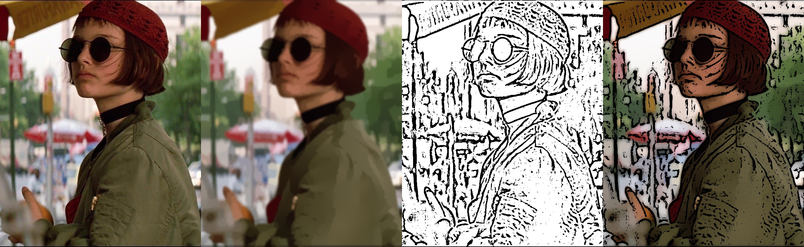
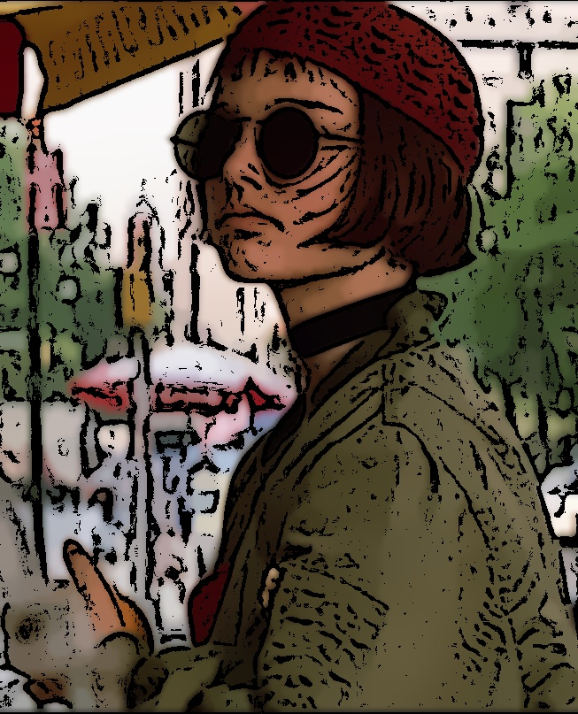
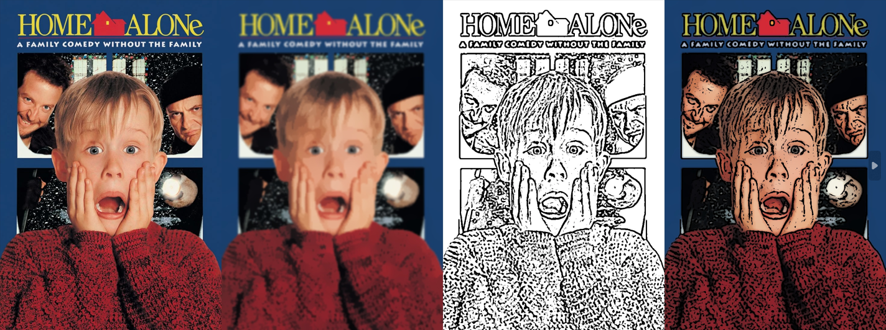
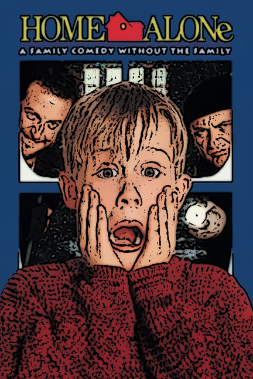

# cartoon_render_program

A Python-based image processing tool that converts any photo into a cartoon-style image using computer vision techniques. Built with OpenCV, it applies bilateral filtering for color smoothing and adaptive thresholding for bold edge detection, producing a hand-drawn cartoon aesthetic.

---

## ✨ Features

- **Color Region Smoothing** — Uses pyramid downsampling + bilateral filtering to flatten color regions while preserving edges
- **Edge Detection** — Applies adaptive thresholding on a median-blurred grayscale image to extract bold, clean outlines
- **Cartoon Composition** — Combines smoothed color and edge mask via bitwise AND to produce the final cartoon effect
- **Side-by-Side Comparison** — Automatically generates a 4-panel comparison image: `Original | Smoothed | Edge | Cartoon`

---

## 🔧 Requirements

```
Python 3.x
opencv-python
numpy
matplotlib
```

Install dependencies:
```bash
pip install opencv-python numpy matplotlib
```

---

## 🚀 Usage

1. Place your image (e.g., `image1.jpg`) in the same folder as the script.
2. Open `cartoon_render_program.py` and set the input path:
   ```python
   input_path = "image1.jpg"
   ```
3. Run the script:
   ```bash
   python cartoon_render_program.py
   ```
4. Output files will be saved:
   - `cartoon_output.jpg` — the cartoonized result
   - `comparison_result.jpg` — side-by-side 4-panel view

---

## 🖼️ Demo

### ✅ Case Where Cartoon Effect Works Well

Images with **distinct color regions and strong contrast** — such as portraits, action figures, or illustrated subjects — respond excellently to this algorithm.

The bilateral filter effectively flattens skin tones, clothing, and backgrounds into solid color blocks, while adaptive thresholding picks up clean outlines around facial features and object boundaries. The result closely resembles hand-drawn comic art.

> **Example:** A photo of a colorful action figure (e.g., Dragon Ball figurine)
> - Large uniform color areas (orange gi, yellow hair) are smoothed cleanly
> - Boundaries between body parts are rendered as bold black outlines
> - The overall result looks convincingly cartoon-like

*(Replace this section with your actual demo screenshot)*

```
[Original]  →  [Smoothed Color]  →  [Edge Mask]  →  [Cartoon Output]
```





---

### ❌ Case Where Cartoon Effect Does Not Work Well

Images with **complex textures, fine details, or low contrast** tend to produce noisy or unsatisfying results.

> **Example:** A dense forest scene or a highly textured surface (e.g., fur, fabric close-up)
> - Fine textures confuse the bilateral filter, leaving color regions blotchy
> - Adaptive thresholding generates excessive noise edges across the entire image
> - The final output looks cluttered rather than cartoon-like

*(Replace this section with your actual demo screenshot)*

---

## ⚠️ Limitations

1. **Texture-heavy images** — The bilateral filter struggles with complex textures (e.g., grass, fur, rough surfaces). It cannot flatten them into clean flat color blocks, resulting in a noisy rather than cartoon-like appearance.

2. **Low-contrast images** — When the difference between adjacent regions is subtle (e.g., overcast sky, pale skin against white background), adaptive thresholding either misses important edges or produces sparse, broken outlines.

3. **Fixed parameter sensitivity** — Parameters such as `num_bilateral`, `sigmaColor`, and the adaptive threshold block size are hardcoded. These work well for typical photos but may require manual tuning for very dark, very bright, or unusually sized images.

4. **Loss of fine detail** — The pyramid downsampling (`pyrDown` / `pyrUp`) intentionally blurs fine details to achieve the flat cartoon look, but this means small text, thin lines, and intricate patterns in the original are lost.

5. **Artifacts at resolution boundaries** — After upsampling, slight misalignment between the smoothed color layer and the edge mask can create thin halos or fringing around object edges, especially on high-resolution inputs.

---

## 📁 File Structure

```
CartoonCraft/
├── cartoon_render_program.py   # Main script
├── image1.jpg                  # Input image (user-provided)
├── cartoon_output.jpg          # Cartoonized output
├── comparison_result.jpg       # 4-panel comparison image
└── README.md                   # This file
```

---

## 🛠️ How It Works

```
Input Image
    │
    ├─▶ [Color Smoothing]
    │       pyrDown × 2  →  bilateralFilter × 7  →  pyrUp × 2
    │
    ├─▶ [Edge Detection]
    │       BGR→Gray  →  medianBlur  →  adaptiveThreshold
    │
    └─▶ [Combine]
            bitwise_AND(smoothed_color, edge_mask)
                │
                ▼
          Cartoon Output
```

---

## 📜 License

This project is for educational purposes.
